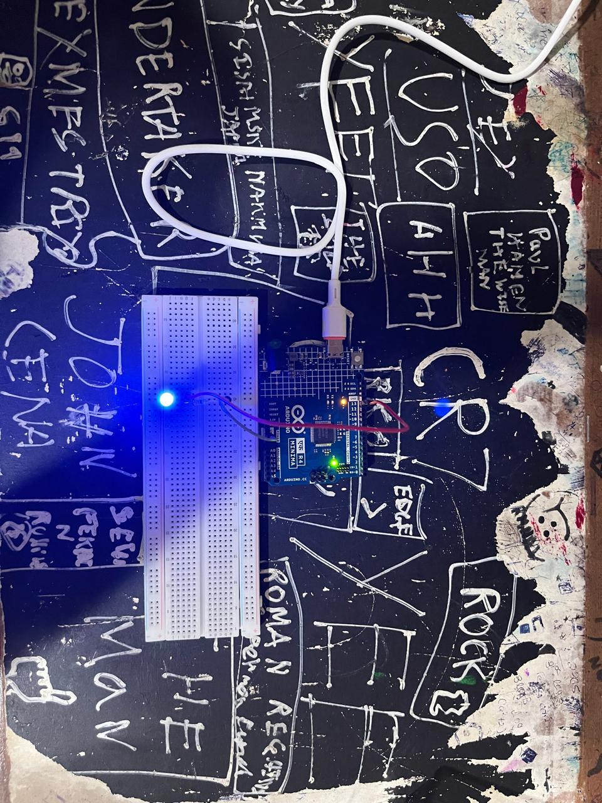

# LED Blink

My first Arduino project — blinking an LED using digital output and timed delays.

## Components
- Arduino UNO R4 Minima
- 1x LED
- 1x 220Ω resistor
- Breadboard + jumper wires

## Board notes
Built using the Arduino UNO R4 Minima — Arduino's newer board featuring 
a 32-bit Renesas RA4M1 (Arm Cortex-M4) processor, an upgrade from the 
classic Uno's 8-bit AVR chip. Functionally compatible with most classic 
Uno tutorials and code, including this one.

## How it works
Uses `digitalWrite()` to toggle a pin HIGH/LOW and `delay()` to control 
timing — the foundational pattern behind most digital output control.
