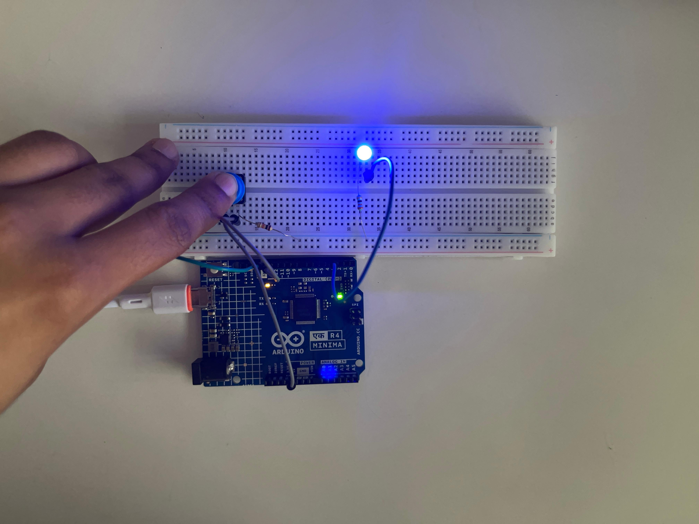

# Push Button LED Control

An Arduino project where a push button controls an LED — pressing the 
button turns the LED on, releasing it turns the LED off.

## Components
- Arduino UNO
- 1x LED
- 1x push button
- 2x resistors (one for the LED, one as a pull-down/pull-up for the button)
- Breadboard + jumper wires

## How it works
The push button is wired to a digital input pin, and the LED to a digital 
output pin. The Arduino continuously reads the button's state with 
`digitalRead()` — when pressed, it sets the LED pin HIGH; when released, 
it sets it LOW.

## What I learned
This builds on my earlier LED Blink and Binary Counter projects by 
introducing digital **input** handling for the first time, not just 
output — reading real-world interaction (a button press) and responding 
to it in code.
