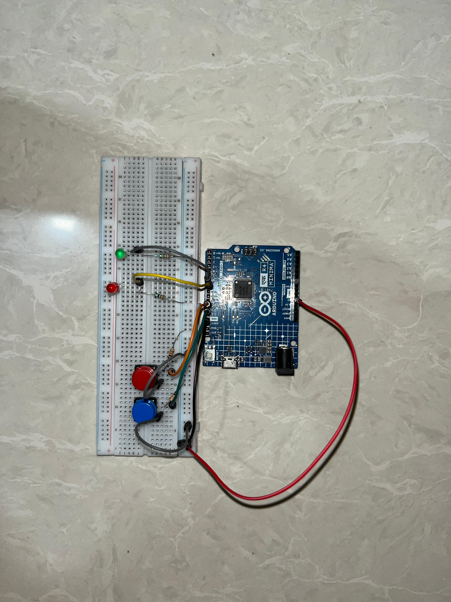

# Half Adder

An Arduino project simulating a half adder circuit — two push button 
inputs representing binary digits, and two LED outputs representing 
the Sum and Carry results.

## Components
- Arduino UNO R4 Minima
- 2x push buttons (inputs: A and B)
- 2x LEDs (outputs: Sum and Carry)
- Resistors for each input and output
- Breadboard + jumper wires

## How it works
A half adder adds two single binary digits and produces two outputs:
- **Sum** = A XOR B
- **Carry** = A AND B

The Arduino reads both button states with `digitalRead()`, computes 
both results, and sets the Sum LED and Carry LED accordingly — turning 
the binary addition truth table into something you can watch happen.

## What I learned
This builds directly on my AND Gate Simulation project — a half adder 
is essentially an AND gate (for Carry) combined with an XOR gate (for 
Sum), working together. Another concept from my Digital Electronics 
coursework, now built and tested in hardware rather than just studied 
on paper.
