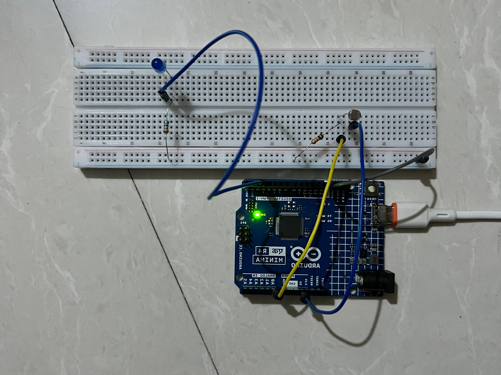
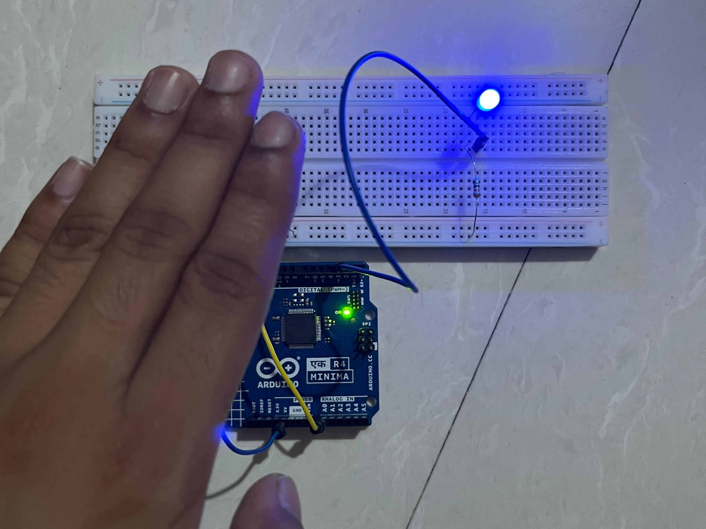

# Automatic Night Light (LDR Sensor)

An Arduino project that automatically turns an LED on when it gets dark 
and off when there's enough light — using a Light Dependent Resistor 
(LDR) as an analog light sensor.

## Components
- Arduino UNO R4 Minima
- 1x LED
- 1x LDR (Light Dependent Resistor)
- 2x resistors (one for the LED, one for the LDR voltage divider)
- Breadboard + jumper wires

## How it works
The LDR's resistance changes with light — high resistance in the dark, 
low resistance in bright light. Wired as part of a voltage divider, this 
lets the Arduino read a changing analog voltage using `analogRead()`. 
When the reading drops below a set threshold (meaning it's dark), the 
Arduino sets the LED pin HIGH; when there's enough light, it turns the 
LED back off.

## What I learned
This is my first project using an **analog** input instead of digital 
(on/off) — previous builds like the push-button LED and logic gates only 
dealt with HIGH/LOW states. Working with the LDR meant reading a range 
of values and deciding on a threshold, a different kind of logic than 
anything I'd built before.
