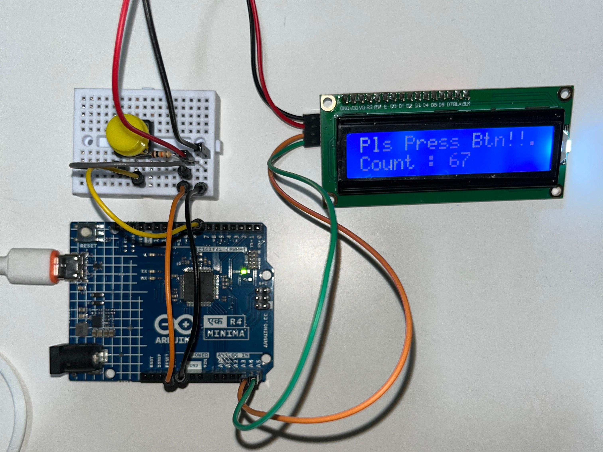

# Push Button Counter with LCD Display

An Arduino project that counts button presses and displays the live 
count on a 16x2 LCD screen.

## Components
- Arduino UNO R4 Minima
- 1x push button
- 1x 16x2 LCD display
- Resistor for the button
- Breadboard + jumper wires

## How it works
The Arduino reads the button's state with `digitalRead()`, incrementing 
a counter variable each time a press is detected. The LCD, controlled 
using the LiquidCrystal library, displays a prompt message along with 
the live count, updating the screen each time the button is pressed.

## What I learned
My first project working with an LCD display instead of just LEDs — 
learning how to wire and communicate with a character display opens 
up a lot more possibilities for showing real information rather than 
just on/off signals.
