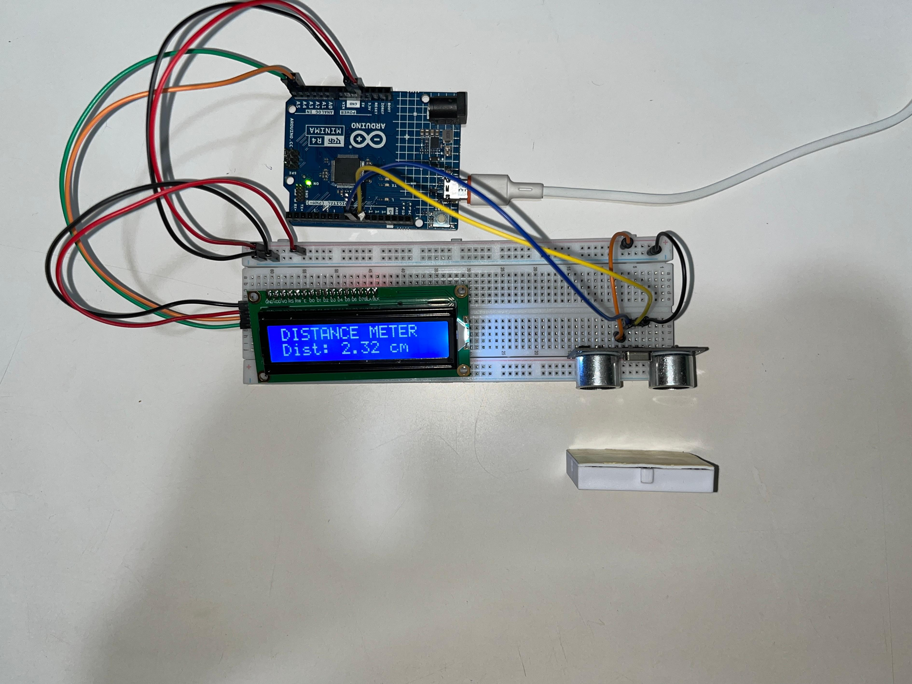

# Ultrasonic Distance Meter

An Arduino project that measures distance using an ultrasonic sensor 
and displays the live reading in centimeters on a 16x2 LCD.

## Components
- Arduino UNO R4 Minima
- 1x HC-SR04 ultrasonic sensor
- 1x 16x2 LCD display
- Breadboard + jumper wires

## How it works
The ultrasonic sensor sends out a sound pulse and measures the time it 
takes to bounce back off a nearby object. Using that time and the speed 
of sound, the Arduino calculates distance and displays the live reading 
on the LCD in centimeters.

## What I learned
Builds on the LCD skills from my push button counter project, combined 
with a new sensor type — measuring physical distance in real time 
rather than just reading a simple digital or analog signal.
