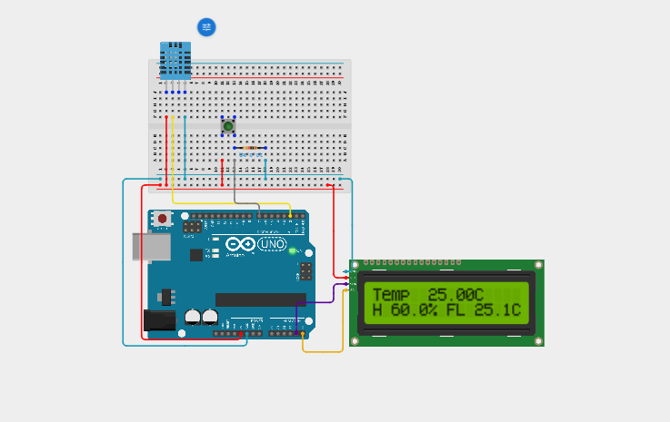
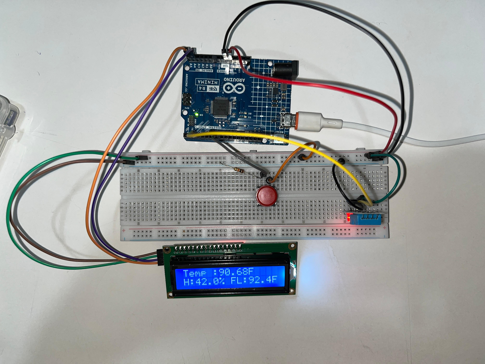

# Digital Weather Station

An Arduino project that measures temperature and humidity using a DHT 
sensor and displays live readings, including a "feels like" value, on 
a 16x2 LCD. A push button switches the temperature display between 
Celsius and Fahrenheit.

## Components
- Arduino UNO R4 Minima
- 1x DHT11 temperature & humidity sensor
- 1x 16x2 LCD display
- 1x push button + resistor
- Breadboard + jumper wires

## How it works
The DHT sensor sends temperature and humidity readings to the Arduino 
over a single data pin. The Arduino reads those values with a sensor 
library, calculates a "feels like" temperature from them, and shows 
everything on the LCD. Pressing the push button toggles the temperature 
display between °C and °F, converting the readings on the fly.

## What I learned
This combines skills from my last few projects: LCD output from the 
counter and distance meter, button input from earlier builds, and a new 
kind of sensor that reports two values at once. The unit toggle also 
taught me to keep track of a state (Celsius or Fahrenheit) that changes 
with each button press. It's the first project where several parts work 
together as one small system.
